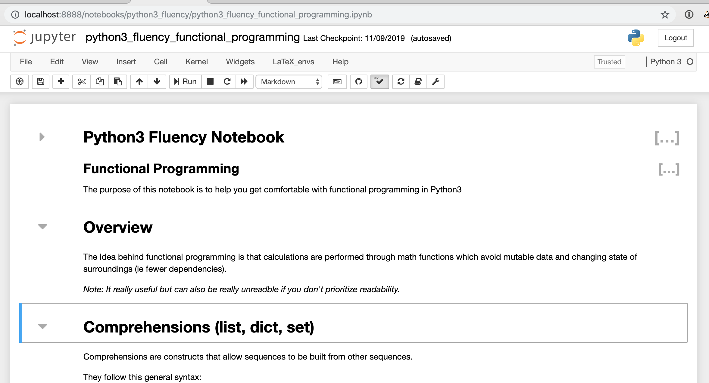
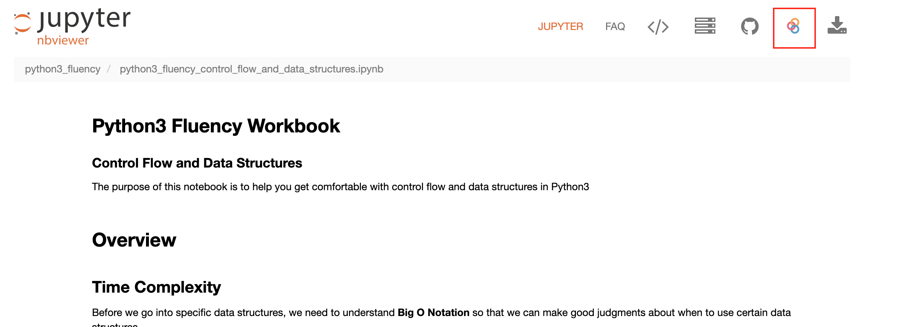

#  Python Fluency Workbooks

This repository contains workbooks to help you become fluent in [Python](https://docs.python.org/3/).

# How to use the content

You can either reference the workbook content online using the link below or run them interactively locally or using Jupyter's online tool nbviewer + binder.

* Read the workbook contents [online](https://nancynobody.github.io/python3_fluency)

* Clone the repo and [execute the workbooks locally](https://jupyter.org/install)

* Launch a live notebook server with these notebooks using [binder](https://nbviewer.jupyter.org/github/nancynobody/python3_fluency/tree/master/notebooks/)

